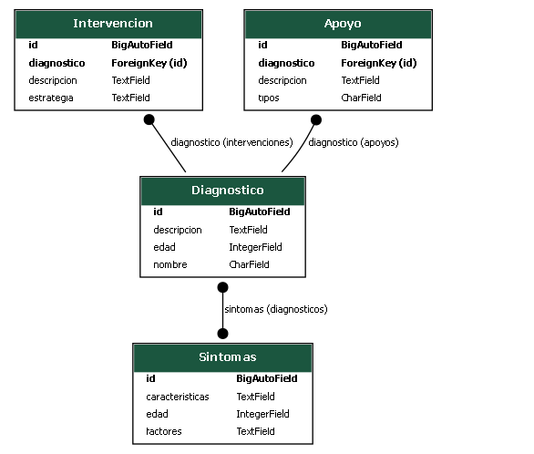

# API de Diagnósticos Clínicos

## Descripción

Esta API pública permite la gestión de diagnósticos clínicos, intervenciones, apoyos y síntomas asociados. Está desarrollada con Django REST Framework y expone endpoints para operaciones CRUD sobre cada modelo, facilitando la integración con sistemas de salud, aplicaciones educativas o de investigación como tambien para la creacion de sitios informativas. 

---

## Diagrama de Modelos

El siguiente diagrama fue generado con el comando:

```bash
python manage.py graph_models consultas -o modelo_consultas.pngÑ
```



---

## Endpoints principales

La API expone los siguientes endpoints bajo el prefijo `/api/`:

- **/api/diagnosticos/**  
  Métodos: GET, POST, PUT, DELETE  
  **Ejemplo de POST:**  
  ```json
  {
    "nombre": "Ansiedad",
    "descripcion": "Respuesta emocional caracterizada por preocupación excesiva, miedo o nerviosismo ante situaciones que perciben como amenazantes. Puede manifestarse a través de síntomas como irritabilidad, dificultad para concentrarse, problemas de sueño y molestias físicas como dolor de estómago",
    "edad": 10,
    "sintomas": 1
  }
  ```

- **/api/intervenciones/**  
  Métodos: GET, POST, PUT, DELETE  
  **Ejemplo de POST:**  
  ```json
  {
    "descripcion": "Intervención Escolar",
    "estrategia": "Programas en colegios que ayudan a los niños a manejar el estrés y mejorar sus habilidades sociales.",
    "diagnostico": 1
  }
  ```

- **/api/apoyos/**  
  Métodos: GET, POST, PUT, DELETE  
  **Ejemplo de POST:**  
  ```json
  {
    "descripcion": "Apoyo escolar",
    "tipos": "Psicológico",
    "diagnostico": 1
  }
  ```

- **/api/sintomas/**  
  Métodos: GET, POST, PUT, DELETE  
  **Ejemplo de POST:**  
  ```json
  {
    "edad": 10,
    "caracteristicas": "Dolor de cabeza",
    "factores": "Ansiedad"
  }
  ```
---
## CHATBOT DE SALUD MENTAL

A continuación se muestra cómo cada endpoint puede ser utilizado por un chatbot para orientar a usuarios sobre ansiedad, depresión y otros trastornos.

---

### Diagnósticos (`consultasSerializer`)
  
Cuando un usuario describe sus síntomas en el chatbot, se realiza una consulta para obtener posibles diagnósticos asociados.

**Solicitud:**
```sh
GET /api/diagnosticos/?sintomas=ansiedad
```

**Respuesta:**
```json
[
    {
        "id": 1,
        "nombre": "Trastorno de ansiedad generalizada",
        "descripcion": "Ansiedad persistente y excesiva que interfiere con la vida cotidiana.",
        "edad": "Adultos y adolescentes",
        "sintomas": ["Preocupación constante", "Dificultad para relajarse", "Problemas de sueño"]
    }
]
```

---

### Intervenciones (`IntervencionSerializer`)
 
Si el usuario pregunta por formas de manejar la ansiedad, el chatbot consulta estrategias recomendadas.

**Solicitud:**
```sh
GET /api/intervenciones/?estrategia=ansiedad
```

**Respuesta:**
```json
[
    {
        "id": 1,
        "descripcion": "Terapia Cognitivo-Conductual",
        "estrategia": "Identificación y modificación de pensamientos negativos."
    },
    {
        "id": 2,
        "descripcion": "Mindfulness y respiración profunda",
        "estrategia": "Ejercicios de atención plena para reducir el estrés."
    }
]
```
---

### Apoyo (`ApoyoSerializer`)

**Ejemplo de uso:**  
Si un usuario expresa sentirse solo o necesita orientación, el chatbot proporciona recursos de ayuda.

**Solicitud:**
```sh
GET /api/apoyos/?tipos=ansiedad
```

**Respuesta:**
```json
[
    {
        "id": 1,
        "descripcion": "Grupos de apoyo en línea",
        "tipos": "Comunidades donde las personas comparten experiencias y consejos."
    },
    {
        "id": 2,
        "descripcion": "Línea de ayuda psicológica",
        "tipos": "Atención inmediata para personas con crisis de ansiedad."
    }
]
```

---

### Síntomas (`SintomasSerializer`)

**Ejemplo de uso:**  
Si el usuario menciona ciertos síntomas, el chatbot devuelve una lista de características y posibles factores que los desencadenan.

**Solicitud:**
```sh
GET /api/sintomas/?edad=adolescentes
```

**Respuesta:**
```json
[
    {
        "edad": "Adolescentes",
        "caracteristicas": ["Preocupación excesiva", "Irritabilidad", "Falta de concentración"],
        "factores": ["Presión escolar", "Problemas familiares", "Uso excesivo de redes sociales"]
    }
]
```